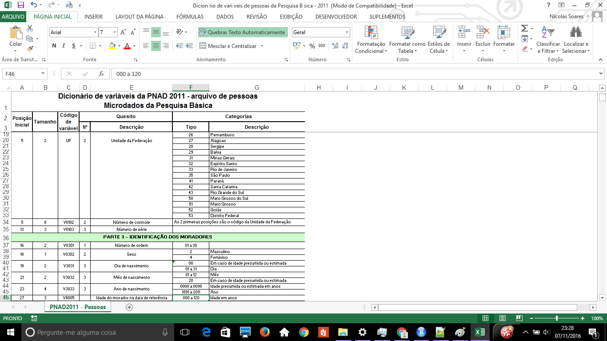

```{r setup, include=FALSE}
library(printr)
library(dplyr)
library(microdadosBrasil)
knitr::opts_chunk$set(echo = FALSE)
```


## Agenda {.build}

- Dificuldades para importar microdados
- microdadosBrasil: overview
- Princípios
    - Separação: código x metadados
    - ambiente de produção
- microdadosBrasil: Estrutura
    - Função principal: `read_data` 
    - CSV com Metadados
    - Wrapper functions
    - Funções auxiliares


## Agenda  {.build}

- Criando novas bases no `microdadosBrasil`
    - Criando metadados
    - Criando dicionários
    - Criando a *wrapper*: `read_NovaBase()`
- Performance
    - Velocidade de importação 
- Comparação com outros pacotes
- Próximos passos

## Refências inciciais {.build}


```{r , eval=FALSE, echo=TRUE}

# github.com/lucasmation/microdadosBrasil

# README_PT.md : documentação em português 

# Instalação:

devtools::install_github("lucasmation/microdadosBrasil")
```

## Dificuldades para importar microdados {.build}

```{r, out.width= "600px"}

knitr::include_graphics("images/image2.PNG")

```


## Dificuldades para importar microdados  {.build}

- Encontrar versão oficial

- Txt colunado( fixed width files)
    - Planilha com Dicionários
    - Programa de leitura: SAS e SPSS

- Falta de harmonização entre os anos
    - Nomes de arquivo 
    - Nomes de variavel
    - Ex: INSTITUICAO\_SUP\_97.txt, ies\_superior\_98.txt
  
- Dados grandes subdivididos em muitos arquivos
    - Ex. RAIS: AC2014.txt,AL2014.txt, AM2014.txt,...
 
 
## Dificuldades para importar microdados 
 
- Passos necessários para importar a PNAD
    1. Baixar os dados do site oficial
    2. Encontrar entre os arquivos as larguras de importação
    3. Encontrar os nomes de pastas e arquivos
    4. Encontrar os nomes das variáveis
    5. Escrever em R

## Dificuldades para importar microdados {.build}

### 1. Baixar os dados do site oficial

```{r, out.width= "800px"}

knitr::include_graphics("images/download_pnad.PNG")

```

## Dificuldades para importar microdados {.build}

### 2. Encontrar entre os arquivos as larguras de importação

```{r, out.width= "800px"}



```

## Dificuldades para importar microdados {.build}

### 2. Encontrar entre os arquivos as larguras de importação
```{r, echo = TRUE}

vars_width <- 
  
  c(4,8,3,2,1,2,2,4,3,1,1,1,1,1,1,2,1,1,1,1,1,1,1,1,1,2,1,1,1,1,1,1,
1,1,2,2,1,1,1,1,1,1,1,1,1,1,1,1,2,1,1,1,1,2,1,1,1,1,1,1,1,1,1,1,
1,1,1,4,5,1,4,5,1,1,12,1,12,1,1,2,1,2,1,1,1,1,1,1,4,5,2,1,1,1,1,1,
1,1,11,7,1,11,7,1,11,7,1,1,1,1,1,11,7,1,11,7,1,11,7,1,1,1,1,1,1,1,1,1,
1,1,1,1,1,1,1,1,1,1,1,1,1,1,1,1,1,1,1,1,1,1,1,1,12,1,12,1,1,1,1,1,
1,1,1,2,1,1,2,2,1,1,2,1,1,1,1,1,1,4,5,2,1,1,1,1,1,1,1,1,1,1,1,1,
2,2,1,1,1,2,4,5,1,1,1,1,1,1,1,12,1,12,1,1,1,2,1,12,1,12,1,1,1,1,2,1,
1,1,2,2,4,5,1,1,1,1,1,1,1,1,1,1,2,1,1,1,2,12,2,12,2,12,2,12,2,12,2,12,
2,12,2,12,1,1,2,2,2,2,1,1,2,2,1,1,1,2,4,1,1,2,2,1,1,1,2,2,2,1,1,2
,1,1,2,2,1,1,1,1,2,2,2,12,12,12,12,12,2,2,1,1,5,5,1,1,1,2,12,2,1,1,1,1
,1,12,8)


```


## Dificuldades para importar microdados {.build}

### 3. Encontrar os nomes de pastas e arquivos

```{r, echo = TRUE}

data_path<- "C:/Users/Nícolas/Documents/PNAD_reponderado_2011_20150814/2011/Dados"

```


## Dificuldades para importar microdados {.build}

### 4. Encontrar os nomes das variáveis


```{r, eval = FALSE, echo = TRUE}


vars<- c("V0101","V0102","V0103","V0301","V0302","V3031","V3032","V3033","V8005","V0401",
"V0402","V0403","V0404","V0405","V0406","V0407","V0408","V0409","V0410","V4111",
"V4112","V4011","v0412","V0501","V0502","V5030","V0504","V0505","V5061","V5062",
"V5063","V5064","V5065","V0507","V5080","V5090","V0510","V0511","V5121","V5122",
"V5123","V5124","V5125","V5126","V0601","V0602","V6002","V6020","V6003","V6030",
"V0604","V0605","V0606","V6007","V6070","V0608","V0609","V0610","V0611","V06111",
"V06112" "V0612","V0701","V0702","V0703","V0704","V0705","V7060","V7070","V0708",
"V7090","V7100","V0711","V7121","V7122","V7124","V7125","V7127","V7128","V0713",
"V0714","V0715","V0716","V9001","V9002","V9003","V9004","V9005","V9906","V9907",
"V9008","V9009","V9010","V9011","V9012","V9013","V9014","V9151","V9152","V9154", 
"V9156","V9157","V9159","V9161","V9162","V9164","V9016","V9017","V9018","V9019", 
 "V9201","V9202","V9204","V9206","V9207","V9209","V9211","V9212","V9214","V9021", 
 "V9022","V9023","V9024","V9025","V9026","V9027","V9028","V9029","V9030","V9031",
 "V9032","V9033","V9034","V9035","V9036","V9037","V9038","V9039","V9040","V9041", 
 "V9042","V9043","V9044","V9045","V9046","V9047","V9048","V9049","V9050","V9051", 
 "V9052","V9531","V9532","V9534","V9535","V9537","V90531","V90532","V90533","V9054", 
 "V9055","V9056","V9057","V9058","V9059","V9060","V9611","V9612","V9062","V9063",
 "V9064","V9065","V9066","V9067","V9068","V9069","V9070","V9971","V9972","V9073", 
 "V9074","V9075","V9076","V9077","V9078","V9079","V9080","V9081","V9082","V9083",
 "V9084","V9085","V9861","V9862","V9087","V9088","V9891","V9892","V9990","V9991", 
 "V9092","V9093","V9094","V9095","V9096","V9097","V9981","V9982","V9984","V9985", 
 "V9987","V9099","V9100","V9101","V1021","V1022","V1024","V1025","V1027","V1028", 
 "V9103","V9104","V9105","V9106","V9107","V9108","V1091","V1092","V9910","V9911", 
 "V9112","V9113","V9114","V9115","V9116","V9117","V9118","V9119","V9120","V9121", 
 "V9921","V9122","V9123","V9124","V1251","V1252","V1254","V1255","V1257","V1258", 
 "V1260","V1261","V1263","V1264","V1266","V1267","V1269","V1270","V1272","V1273", 
 "V9126","V1101","V1141","V1142","V1151","V1152","V1153","V1154","V1161","V1162", 
 "V1163","V1164","V1107","V1181","V1182","V1109","V1110","V1111","V1112","V1113", 
 "V1114","v1115","V4801","V4802","V4803","V4704","V4805","V4706","V4707","V4808", 
 "V4809","V4810","V4711","V4812","V4713","V4814","V4715","V4816","V4817","V4718", 
 "V4719","V4720","V4721","V4722","V4723","V4724","V4727","V4728","V4729","V4732", 
 "V4735","V4838","V6502","V4741","V4742","V4743","V4745","V4746","V4747","V4748", 
 "V4749","V4750","V9993")


```


## Dificuldades para importar microdados {.build}

### 5. Importar no R

```{r, eval = FALSE, echo = TRUE}

d<- read.fwf(file = paste0(data_path, "PES2011.txt"),
                           widths = vars_width,
                            col.names = vars)


```

- E esperar um bom tempo para carregra os dados

## Dificuldades para importar microdados {.build}

- E se quiseramos importar outro os dados de um período diferente? 
- Começe do passo 1 novamente


## Deveria ser fácil


```{r , eval=FALSE, echo=TRUE}
#Download
download_sourceData("PNAD", 2002, unzip = T)
```

```{r , eval=FALSE, echo=TRUE}
#Importando os dados
d  <- read_PNAD("domicilios", 2002)
```

## Separação: código x metadados


### Hadley Wickham, mai/2016, Managing many models with R

```{r, out.width= "600px"}

knitr::include_graphics("images/cupcakes_vanilla1.PNG")

```


## Separação: código x metadados


```{r, out.width= "600px"}

knitr::include_graphics("images/cupcakes_vanilla1.PNG")

```


## Separação: código x metadados


```{r, out.width= "600px"}

knitr::include_graphics("images/Chocolate_cupcakes.JPG")

```

## Separaçãoo: código x metadados

```{r, out.width= "600px"}

knitr::include_graphics("images/Chocolate_cupcakes2.JPG")

```


## Separação: código x metadados

```{r, out.width= "600px"}

knitr::include_graphics("images/vanilla_cupcakes2.JPG")

```


## Separação: código x metadados

```{r, out.width= "600px"}

knitr::include_graphics("images/Vanilla_cupcakes3.JPG")

```


## Separaçãoo: código x metadados

```{r, out.width= "600px"}

knitr::include_graphics("images/Vanilla_cupcakes4.JPG")

```

## Separação: código x metadados

```{r, out.width= "600px"}

knitr::include_graphics("images/capcakes_van_choc.JPG")

```


## Separação: código x metadados

```{r, out.width= "600px"}

knitr::include_graphics("images/capcakes_van_choc2.JPG")

```

## Controle de versão

 - Produzido utilizando GitHub
 - Mostrar exemplo


## Função principal: `read_data` {.build}

<style type="text/css">

code.r{
  font-size: 27px;
}
</style>


```{r eval = FALSE, echo = TRUE}
read_data(dataset, ft, i, 
          metadata = NULL,
          dic_list = NULL, 
          var_translator = NULL, 
          root_path = NULL,
          file = NULL
          ) 
```

- Função de importação genérica

## Função principal: `read_data` {.build}

- Parâmetros:
    - *dataset*: Referência básica para a função de importação, procurará o dicionário e os metadados com base nesses nomes.
    - Arquivo com metadatados: inst/extadata/PNAD_files_harmonization.csv
    - Arquivos com dicionarios: data/PNAD_dics.rda
    - O nome da base de dados é suficiente para identificar todos os componentes auxiliares necessários para a leitura
    
    
    
## Função principal: `read_data` {.build}


- Parâmetros:
    - *ft*: Tipo de arquivo que será utilizado(Ex: "matrículas" dentro do Censo Escolar)
    - *i*: Período do arquivo que será utilizado( Ex: 2012)
    - *root_path*: local dos arquivos, se não for fornecido, procurará no Working Directory
    - *metadata*: data.frame contendo as informações necessárias para a leitura da base de dados, se `NULL` é utilizada a tabela encontrada pelo nome padrão do arquivo `inst/extadata/dataset_files_harmonization.csv`    
    - *file*: se preenchido, ignora os metadatados e o `root_path` e lê direto o arquivo indicado,
  

## Wrapper functions {.build}


 - Traduz a função  `read_data` em argumentos mais amigáveis ao usuário.
 - Lidar com exceões
 - perceba que identificador *dataset* é suficiente para encontrar metadados para uma dada pesquisa.

```{r eval = FALSE, echo = TRUE}
read_PNAD<- function(ft,i,root_path=NULL,file = NULL){

  data<-read_data(dataset = "PNAD", ft, i, root_path =  root_path, file = file)

  r
```

 
## CSV com Metadados

```{r echo = FALSE}

csv_file<- read.csv("examples/template_csv.csv", sep = ";")
head(csv_file %>% select(1:5))

```

## CSV com Metadados


```{r echo = FALSE}

csv_file<- read.csv("examples/template_csv.csv", sep = ";")
head(csv_file %>% select(6:9))

```


## Funções auxiliares

```{r, eval = FALSE, echo = TRUE}
  parses_SAS_import_dic(file = "DICIONARIO.SAS")
```

- Método para traduzir dicionários SAS
- Facilidade de replicação

## Funções auxiliares 
```{r, echo =  TRUE}
get_import_dictionary("CensoEscolar", 2000, 'escola') %>% head

```


## Velocidade de importação dos dados


## Comparação com outros pacotes

```{r echo = FALSE}

packages<- read.csv("examples/comparacao_pacotes.csv", sep = ";", row.names = 1)

packages


```

## Comparaão com outros pacotes

```{r, echo = FALSE}

packages<- read.csv("examples/comparacao_pacotes2.csv", sep = ";")

packages


```


## Próximos passos

- Tornar o processo de criação de metadados/dicionários mais amigável 
- DADOS > memória RAM: MonetDBLite
- Desenho amostral complexo( PNAD, PNAD contínua)
- Inclusão de mais bases
    - Provas do INEP
    - IBGE: PNS, ...
    - Versões mais antigas: PNAD desde 1976, Censo desde 1970.
    - Sugestões...


[1]: https://github.com/lucasmation/microdadosBrasil
[2]: https://github.com/lucasmation/microdadosBrasil/blob/master/README_PT.md


