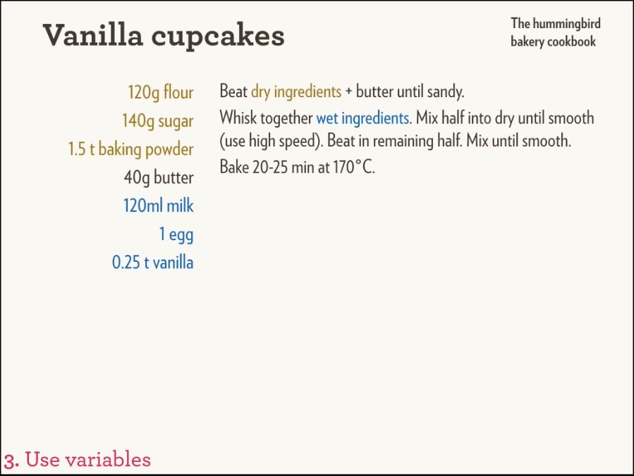
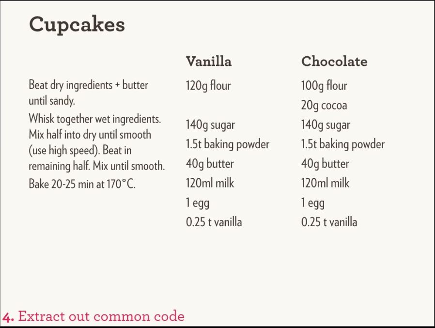
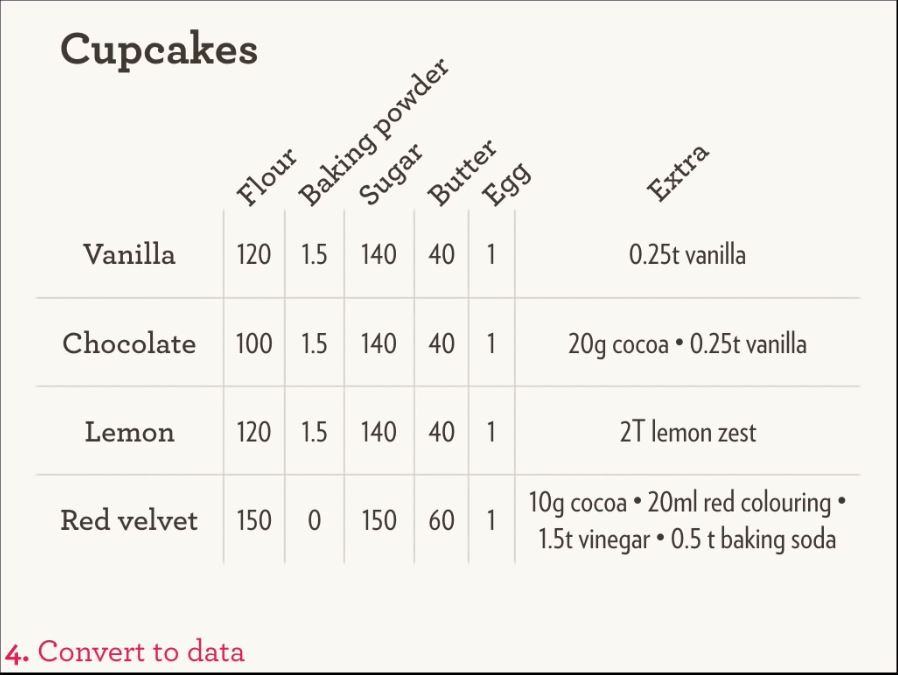

```{r setup, include=FALSE}
library(printr)
library(dplyr)
library(microdadosBrasil)
knitr::opts_chunk$set(echo = FALSE)
```


## Agenda

- Dificuldades para importar microdados
- microdadosBrasil: overview
- Princípios
    - Separação: código x metadados
    - ambiente de produção
- microdadosBrasil: Estrutura
    - Função principal: read_data 
    - CSV com Metadados
    - Wrapper functions
    - Funções auxiliares

## Agenda

- Performance
    - Velocidade de importação 
- Comparação com outros pacotes
- Próximos passos

## Referências inciciais {.build}


```{r , eval=FALSE, echo=TRUE}

# github.com/lucasmation/microdadosBrasil

# README_PT.md : documentação em português 

# Instalação:
devtools::install_github("lucasmation/microdadosBrasil")
```


## Dificuldades para importar microdados

<div style="width:30px; height=20px">

</div>
 
	


## Dificuldades para importar microdados

- Encontrar versão oficial

- Txt colunado( fixed width files)
    - Planilha com Dicionários
    - Programa de leitura: SAS e SPSS

- Falta de harmonização entre os anos
    - Nomes de arquivo 
    - Nomes de variavel
    - Ex: INSTITUICAO\_SUP\_97.txt, ies\_superior\_98.txt
  
- Dados grandes subdivididos em muitos arquivos
    - Ex. RAIS: AC2014.txt,AL2014.txt, AM2014.txt,...
 


## Dificuldades para importar microdados

- Passos necessários para importar a PNAD
    - Baixar os dados do site oficial
    - Encontrar entre os arquivos as larguras de importação
    - Encontrar os nomes de pastas e arquivos
    - Encontrar os nomes das variáveis
    - Escrever em R

```{r, eval = FALSE, echo = TRUE}
pes2011 <- read.fwf(file='PNAD2011/Dados/2011_PES.TXT', 
                    widths=c(4,2,11,1,8,3,3,1,9,1,42,1,1,65,4,5,2,157,12,418,5,1))

names(pes2011) <- c("V0101","UF","controle","V0302",
                    "skip2","V8005","skip3","V0404",
                    "skip4","V4011","skip5","V06111",
                    "V06112","skip6","V9906","skip7",
                    "V9008","skip8","V9532","skip9",
                    "V4729","skip10")


```


## Deveria ser fácil


```{r , eval=FALSE, echo=TRUE}
#Download
download_sourceData("PNAD", 2002, unzip = T)
```

```{r , eval=FALSE, echo=TRUE}
#Importando os dados
d  <- read_PNAD("domicilios", 2002)
```

## Separação: código x metadados


###Hadley Wickham, mai/2016, Managing many models with R

<div style="width:30px; height=20px">

</div>


## Separação: código x metadados


<div style="width:30px; height=20px">

</div>


## Separação: código x metadados


<div style="width:30px; height=20px">

</div>

## Separação: código x metadados

<div style="width:30px; height=20px">

</div>


## Separação: código x metadados

<div style="width:30px; height=20px">

</div>

## Separação: código x metadados

<div style="width:30px; height=20px">

</div>

## Separação: código x metadados

<div style="width:30px; height=20px">

</div>

## Separação: código x metadados

<div style="width:30px; height=20px">

</div>

## Separação: código x metadados

<div style="width:30px; height=20px">

</div>

## Controle de versão

 - Produzido utilizando GitHub
 - Mostrar exemplo


## Função principal: read_data()

<style type="text/css">

code.r{
  font-size: 27px;
}
</style>


```{r eval = FALSE, echo = TRUE}
read_data(ft, i, metadata,
          dic_list = NULL, 
          var_translator = NULL, 
          root_path = NULL
          ) 
```

- Função de importação genérica

- Parâmetros:
    - *ft*: Tipo de arquivo que será utilizado(Ex: "matrículas" dentro do Censo Escolar)
    - *i*: Período do arquivo que será utilizado
    - *root_path*: local dos arquivos, se não for fornecido, procurará no Working Directory
    - *dic_list*: Dicionário de importação
    - *metadata*: data.frame contendo as informações necessárias para a leitura da base de dados    
  

## Wrapper functions

```{r eval = FALSE, echo = TRUE}
read_PNAD<- function (ft, i, root_path = NULL) 
{
  metadata <- read_metadata("PNAD")
  data("PNAD_dics")
  data <- read_data(ft, i, metadata, dic = PNAD_dics, root_path = root_path)
  return(data)
}
```

 - Traduz a função read_data() em argumentos mais amigáveis ao usuário.
 - Lidar com exceções
 
## CSV com Metadados

```{r echo = FALSE}

csv_file<- read.csv("examples/template_csv.csv", sep = ";")
head(csv_file %>% select(1:5))

```

.

.

.


```{r echo = FALSE}

csv_file<- read.csv("examples/template_csv.csv", sep = ";")
head(csv_file %>% select(6:9))

```


## Funções auxiliares

```{r, eval = FALSE}
  parses_SAS_import_dic(file = "DICIONARIO.SAS")
```

- Método para traduzir dicionários SAS
- Facilidade de replicação

## Funções auxiliares 
```{r, echo =  TRUE}
get_import_dictionary("CensoEscolar", 2000, 'escola') %>% head

```


## Velocidade de importação dos dados


<div style="width:30px; height=20px">

</div>

## Comparação com outros pacotes

```{r echo = FALSE}

packages<- read.csv("examples/comparacao_pacotes.csv", sep = ";", row.names = 1)

packages


```

## Comparação com outros pacotes

```{r, echo = FALSE}

packages<- read.csv("examples/comparacao_pacotes2.csv", sep = ";")

packages


```


## Próximos passos


- DADOS > memória RAM: MonetDBLite
- Desenho amostral complexo( PNAD, PNAD contínua)
- Inclusão de mais bases
    - Provas do INEP
    - IBGE: PNS, ...
    - Versões mais antigas: PNAD desde 1976, Censo desde 1970.
    - Sugestões...


[1]: https://github.com/lucasmation/microdadosBrasil
[2]: https://github.com/lucasmation/microdadosBrasil/blob/master/README_PT.md


